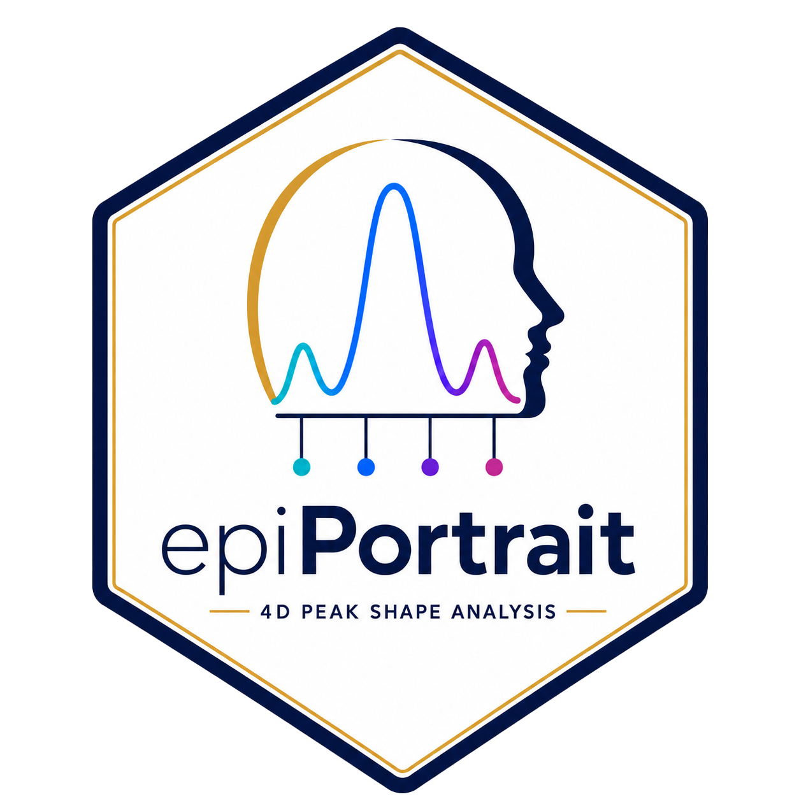

```{r readme-setup, include = FALSE}
knitr::opts_chunk$set(
  collapse  = TRUE,
  comment   = "#>",
  fig.width  = 8,
  fig.height = 5,
  message    = FALSE,
  warning    = FALSE,
  eval       = FALSE
)
```

# epiPortrait 

**4D Geometric Profiling of Epigenetic Landscapes — Beyond Intensity**

[](https://github.com/zhangying/epiPortrait)
[-blue.svg)](https://www.gnu.org/licenses/gpl-3.0)
[](https://www.bioconductor.org)
[](https://lifecycle.r-lib.org/articles/stages.html)

---

## Why epiPortrait?

Traditional ChIP-seq / ATAC-seq / CUT&Tag analyses treat genomic regions as
one-dimensional features, focusing almost exclusively on signal **Intensity**
(read counts). However, the physical conformation of chromatin domains carries
additional biological meaning that raw counts cannot capture:

- **Width** — lateral spreading of the mark (super-enhancers, heterochromatin expansion)
- **Height** — local recruitment density at the summit (focal complex assembly)
- **Skewness** — asymmetric signal distribution within the domain (directional spreading, transcription-coupled remodeling)

`epiPortrait` builds a **4D geometric portrait matrix** from BigWig coverage
profiles and applies **MANOVA** to detect **Shape Shift** events — regulatory
regions where the physical conformation of the epigenome changes significantly
between conditions, even when total read counts do not.

---

## Installation

```{r install}
if (!require("BiocManager", quietly = TRUE)) install.packages("BiocManager")
BiocManager::install(c(
  "GenomicRanges", "SummarizedExperiment", "ChIPseeker",
  "GenomicFeatures", "limma", "clusterProfiler",
  "org.Hs.eg.db", "org.Mm.eg.db"
))

# Install epiPortrait from GitHub
devtools::install_github("zhangying/epiPortrait", build_vignettes = TRUE)
```

---

## Core Module 1: Build the 4D Portrait Matrix

The foundation of epiPortrait: extract geometric features from BigWig coverage
at every consensus domain.

```{r module1}
library(epiPortrait)

# 1. Prepare sample sheet
samples <- data.frame(
  SampleID  = c("Ctrl_1", "Ctrl_2", "Ctrl_3", "Treat_1", "Treat_2", "Treat_3"),
  Condition = c("Control", "Control", "Control", "Treatment", "Treatment", "Treatment"),
  bw_path   = c("ctrl1.bw", "ctrl2.bw", "ctrl3.bw", "treat1.bw", "treat2.bw", "treat3.bw")
)

# 2. Get consensus peaks from your peak files
# consensus_peaks <- get_consensus_peaks(peak_list, min_reps = 2)

# 3. Optionally stitch proximal peaks into macro-domains
# macro_domains <- stitch_epi_peaks(consensus_peaks, stitch_distance = 12500)

# 4. Build the 4D portrait matrix
se <- build_portrait_matrix(
  sample_sheet    = samples,
  consensus_peaks = consensus_peaks,
  workers         = 4,
  bg_quantile     = 0.1,
  cache_dir       = "epiPortrait_cache"
)

# 5. Normalize
se <- normalize_portrait(se, method = "TotalSignal")
```

**Key Parameters:**

- **`workers`**: Number of parallel threads via `BiocParallel`. Use `workers = 1` on Windows.
- **`bg_quantile`**: Signals below this quantile within each peak are excluded from skewness estimation (Valley Trap — removes background noise).
- **`on_disk`**: When `TRUE`, stores assays as HDF5 files via `HDF5Array`. Recommended for mammalian-scale (> 100K peaks) processing.
- **`cache_dir`**: Directory to cache per-sample BigWig coverage views as RDS files. Subsequent runs skip BigWig I/O entirely when the BigWig + peaks combination is unchanged.
- **`custom_features`**: Named list of functions; each receives coverage views for one peak and returns a numeric value, enabling user-defined geometric dimensions.

**Output Data Dictionary — SummarizedExperiment:**

| Assay | Description | Dimensions |
|:------|:------------|:-----------|
| `Width` | Physical span of the domain (bp); identical across all samples | N peaks × S samples |
| `Intensity` | Total signal abundance (area under BigWig curve) | N × S |
| `Height` | Maximum signal density at the summit | N × S |
| `Skewness` | Background-gated robust skewness of the signal distribution | N × S |

---

## Core Module 2: Shape Shift Detection

### 2a. Global Multivariate Test (MANOVA)

`test_global_shape_shift()` simultaneously evaluates all four geometric
dimensions to detect **Shape Shift** events — regions where the joint
conformation differs between conditions.

```{r module2a}
# Simple two-group comparison
shift_res <- test_global_shape_shift(
  se,
  group_var = "Condition",
  test      = "Pillai",
  workers   = 4
)

# Complex multi-factor design
shift_res <- test_global_shape_shift(
  se,
  formula = ~ genotype * treatment + batch,
  term    = "genotype:treatment"
)
```

**Key Parameters:**

- **`formula`**: Any model formula referencing `colData(se)` columns. When `NULL`, falls back to `group_var` + optional `block_var`.
- **`test`**: MANOVA test statistic. `"Pillai"` (default) is most robust to unequal covariance matrices. Also `"Wilks"`, `"Hotelling-Lawley"`, or `"Roy"`.
- **`term`**: Which model term to report as the effect of interest. Default auto-selects the last term.
- **`block_var`**: Optional blocking variable for paired or batch designs.

**Output Data Dictionary — test_global_shape_shift():**

| Column | Description |
|:-------|:------------|
| `seqnames`, `start`, `end` | Genomic coordinates of the domain |
| `Peak_ID` | Unique peak identifier (matches `rownames(se)`) |
| `Shape_Shift_Score` | Pillai trace value (0–1); larger = stronger multivariate shift |
| `partial_eta_sq` | Partial eta-squared (0–1); proportion of multivariate variance explained by group |
| `P.Value` | Raw P-value from MANOVA |
| `adj.P.Val` | Benjamini-Hochberg adjusted P-value |
| `Status` | Computation status: `"OK"`, `"Low_Variance"`, or `"MANOVA_Error"` |

### 2b. Per-Dimension Differential Testing

```{r module2b}
# limma-based differential Intensity (recommended for small n)
diff_res <- test_differential_feature(
  se,
  feature      = "Intensity",
  group_var    = "Condition",
  target_group = "Treatment",
  ref_group    = "Control",
  method       = "limma",
  block_var    = "Patient"   # optional
)

# Test Height, Width, or Skewness similarly
diff_height <- test_differential_feature(se, feature = "Height", ...)
diff_width  <- test_differential_feature(se, feature = "Width",  ...)
```

**Key Parameters:**

- **`feature`**: Any assay in the SE (`"Intensity"`, `"Height"`, `"Width"`, `"Skewness"`, or custom feature name).
- **`method`**: `"limma"` (recommended, uses empirical Bayes moderation), `"t.test"`, or `"wilcox"`.
- **`block_var`**: Enables paired testing for t.test / Wilcoxon, or covariate adjustment for limma.

---

## Core Module 3: Shape Shift Classification

`classify_shape_shift()` translates abstract Pillai scores into six
biologically interpretable categories.

```{r module3}
shift_res <- classify_shape_shift(
  se, shift_res,
  group_var    = "Condition",
  target_group = "Treatment",
  ref_group    = "Control",
  fc_threshold     = 0.5,    # log2 fold-change
  skewness_threshold = 0.3   # absolute delta
)

table(shift_res$Shape_Class)
```

| Class | Pattern | Biological Interpretation |
|:------|:--------|:--------------------------|
| **Concentration** | Height ↑, Intensity stable | Signal concentrates at summit — tighter regulatory focus |
| **Flattening** | Height ↓, Intensity stable | Signal spreads across domain — regulatory broadening |
| **Polarity Shift** | Skewness dominates | Asymmetric redistribution — directional spreading or collapse |
| **Global Gain** | Intensity ↑, Height concordant | Coordinated increase — activation or chromatin opening |
| **Global Loss** | Intensity ↓, Height concordant | Coordinated decrease — repression or closing |
| **Complex** | ≥ 2 dimensions discordant | Multi-dimensional structural remodelling |

<div align="center">

<p><em>Figure 1: Six epiPortrait shape shift classes illustrated on schematic coverage profiles.</em></p>
</div>

---

## Core Module 4: Outlier Detection & QC

### 4a. 4D Conformational Outlier Detection

```{r module4a}
# Find domains with intrinsically unusual 4D geometry
outliers <- detect_conformational_outliers(
  se,
  method      = "robust",    # MCD robust covariance
  ref_samples = NULL         # NULL = all samples
)

# Single-sample analysis: normal cohort as reference
outliers <- detect_conformational_outliers(
  se,
  method      = "robust",
  ref_samples = c("Normal_1", "Normal_2", "Normal_3")
)

head(outliers[, c("Peak_ID", "Mahalanobis_D2", "adj.P.Val", "Outlier_Flag")])
```

**Key Parameters:**

- **`method`**: `"robust"` (MCD, default) for outlier-resistant covariance estimation; `"classic"` for standard MLE.
- **`ref_samples`**: Character vector of sample names defining the reference distribution. When `NULL`, all samples form the reference. Useful for query-vs-reference (e.g., tumor vs normal panel).
- **`collapse_fun`**: Function collapsing per-sample values to a single value per domain. Default `rowMeans(na.rm = TRUE)`.

**Output Data Dictionary — detect_conformational_outliers():**

| Column | Description |
|:-------|:------------|
| `seqnames`, `start`, `end` | Genomic coordinates |
| `Peak_ID` | Domain identifier |
| `Mahalanobis_D2` | Squared Mahalanobis distance to the reference centroid |
| `P.Value` | χ²(4) P-value |
| `adj.P.Val` | BH-adjusted P-value |
| `Outlier_Flag` | Logical; `TRUE` if `adj.P.Val < 0.05` |

### 4b. Manhattan Plot of Conformational Outliers

```{r module4b}
plot_outlier_manhattan(
  outliers,
  y_axis    = "logP",      # or "D2" for raw Mahalanobis distance
  label_n   = 10,          # label top 10 outliers
  label_col = "SYMBOL"     # use gene names if available
)
```

### 4c. Standard QC Visualizations

```{r module4c}
# PCA on any geometric dimension
plot_portrait_pca(se, feature = "Intensity", group_var = "Condition", n_top = 1000)

# Sample correlation heatmap
plot_portrait_correlation(se, feature = "Intensity")
```

---

## Core Module 5: Publication-Ready Visualizations

### 4D Volcano Plot

X-axis: Intensity log2 fold-change | Y-axis: -log10(adj.P.Val) |
Point size: domain width | Point color: skewness shift.

```{r module5a}
plot_portrait_volcano(
  diff_res, se,
  target_group = "Treatment",
  ref_group    = "Control",
  p_cutoff     = 0.05,
  fc_cutoff    = 1
)
```

### Radar Chart: Single-Peak 4D Conformation

```{r module5b}
top_peak <- shift_res$Peak_ID[shift_res$adj.P.Val < 0.05][1]
plot_peak_portrait(se, peak_id = top_peak, group_var = "Condition")
```

### Group Overlay Tracks (Shape Shift Validation)

The most intuitive validation: overlay group-mean coverage profiles with
± SEM ribbons on the same panel.

```{r module5c}
plot_shift_comparison(
  se, peak_id = top_peak,
  group_var = "Condition",
  group1    = "Control",
  group2    = "Treatment",
  extend_bp = 1000
)
```

### Hockey Stick (ROSE-Style Super-Domain Identification)

```{r module5d}
se <- call_super_domains(se, feature = "Intensity")
plot_hockey_stick(se, feature = "Intensity", top_n_label = 10)
```

**Key Parameters for `call_super_domains()`:**

- **`feature`**: `"Intensity"` → Super-Element, `"Width"` → Broad-Domain, `"Height"` → Steep-Peak.
- **`sample_id`**: Which sample to use for ranking. Default `"Mean"` uses row means.

---

## Core Module 6: Temporal & Dose-Response Shape Drift

```{r module6}
# Timepoints must be numeric and ordered
se$Timepoint <- c(0, 0, 2, 2, 6, 6, 24, 24)  # example

temporal_res <- test_temporal_shape_shift(
  se,
  time_var   = "Timepoint",
  block_var  = "Patient",    # optional
  poly_order = 2,            # linear + quadratic trends
  workers    = 4
)

head(temporal_res[, c("Peak_ID", "Linear_Pval", "Quadratic_Pval", "adj.P.Val")])
```

**Key Parameters:**

- **`poly_order`**: Maximum polynomial order. 2 = linear + quadratic; 3 = also tests cubic trends. Each order consumes 1 degree of freedom.
- **`time_var`**: Must be numeric or convertible to numeric with ≥ 3 distinct values.

---

## Core Module 7: Power Analysis & Experimental Design

Before running your experiment: how many biological replicates do you need to
detect a shape shift of a given magnitude?

```{r module7}
power_df <- simulate_power(
  n_range    = 3:10,
  eta2_range = c(0.06, 0.14, 0.30, 0.50),   # medium, large, very large
  n_dims     = 2,     # how many dimensions carry the true effect
  n_sim      = 200,
  workers    = 4
)

plot_power_curve(power_df)
```

**Key Parameters:**

- **`eta2_range`**: Partial eta-squared benchmarks: 0.01 = small, 0.06 = medium, 0.14 = large (multivariate context).
- **`n_dims`**: Number of dimensions (1–4) where the true effect is embedded.

---

## Core Module 8: Annotation, Enrichment & Export

```{r module8}
# Genomic annotation via ChIPseeker
anno_df <- annotate_epi_peaks(
  shift_res[shift_res$adj.P.Val < 0.05, ],
  genome = "hg38",          # also "hg19", "mm10", or "custom"
  tss_region = c(-3000, 3000)
)

# GO + KEGG enrichment per shape class
enrich_res <- enrich_shape_shifted(shift_res, organism = "human")

# Biological narrative synthesis
narrative <- summarize_findings(shift_res, se,
  enrichment_res = enrich_res,
  fdr_cutoff     = 0.05
)
cat(narrative$full_text)

# Export: BED file for IGV / HOMER
export_shifted_bed(shift_res, "shape_shifted_regions.bed", fdr_cutoff = 0.05)

# Export: IGV session (double-click to open)
export_igv_session(shift_res, se, genome = "hg38", session_file = "epiPortrait_session.xml")
```

---

## One-Click Parameterised Report

Generate a complete HTML report in a single call. Modules auto-hide when
their parameters are left at `NULL`.

```{r report}
render_report(
  sample_sheet       = samples,
  consensus_peaks    = consensus_peaks,
  genome             = "hg38",
  target_group       = "Treatment",
  ref_group          = "Control",
  super_domain_feature = "Intensity",
  output_file        = "epiPortrait_analysis.html"
)
```

You can also create an R Markdown document from the built-in template:
*File > New File > R Markdown... > From Template > epiPortrait Report*.

---

## Contact

**Ying ZHANG**\
Zhejiang University\
<zhangying@example.com>

Issues and feature requests: <https://github.com/zhangying/epiPortrait/issues>

---

## Citation

> ZHANG Y. (2025). *epiPortrait: Multi-Dimensional Geometric Profiling of
> Epigenetic Landscapes*. R package version 0.1.0.
> <https://github.com/zhangying/epiPortrait>

```bibtex
@manual{epiPortrait,
  title  = {epiPortrait: Multi-Dimensional Geometric Profiling of Epigenetic Landscapes},
  author = {Ying Zhang},
  year   = {2025},
  note   = {R package version 0.1.0},
  url    = {https://github.com/zhangying/epiPortrait}
}
```

---

```{r session-info, echo = FALSE}
sessionInfo()
```
